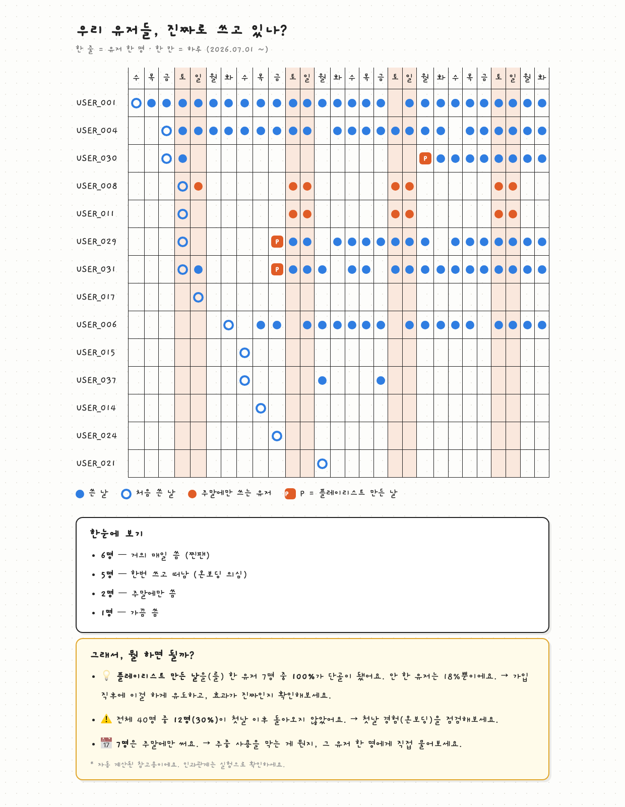

# Dot Plot MCP

> DAU/MAU 말고, 유저 한 명 한 명을 보세요.

[English](README.md) | **한국어**



DAU/MAU 그래프는 신규 유저가 들어오는 한 "우상향"합니다 — 아무도 남지 않아도요.
이 MCP 서버는 YC 파트너 David Lieb의
[Dot Plot 방법론](https://www.youtube.com/watch?v=e5-6rEwzxLs)을 구현합니다:
유저가 수백 명이 되기 전까지, 창업자에게 필요한 최고의 대시보드는
**유저 한 명 = 한 줄, 하루 = 한 칸**인 표 하나입니다.

**설계 원칙: 숫자는 코드가 계산하고, AI는 해석만 합니다.** 그래서 통계가 틀리지 않습니다.

## 뭘 해주나

```
① 추적 점검   코드에 심은 이벤트 vs 실제 찍힌 데이터 대조 → 고장·구멍 발견
② 도트 플롯   유저별 활동을 점으로 — 이탈, 주말러, 찐팬이 한눈에
③ 패턴 분류   한번쓰고떠남 / 주말에만 / 거의매일 자동 분류
④ 아하 탐색   모든 행동을 훑어서 "단골로 바꾸는 행동" 후보 발견
⑤ 리포트     손그림 스타일 HTML + 쉬운 말 인사이트 → 링크로 공유
⑥ 벤치마크   (옵트인) 같은 업종·단계 팀들과 내 지표 비교
```

### 30초 데모


## 시작하기

필요한 것: [uv](https://docs.astral.sh/uv/), 그리고 `user_id, date, event` 3칸짜리 CSV
(`platform` 칸을 4번째로 넣으면 도트 플롯에 라벨로 같이 표시됩니다 — 선택).

명령 한 줄 — 클론도 설정도 필요 없습니다:

```bash
claude mcp add dotplot -- uvx dotplot-mcp
```

데이터가 아직 없다면 클론해서 샘플로 체험:

```bash
uv run sample_data.py   # events.csv 생성 (가짜 유저 40명)
uv run demo.py          # 전체 파이프라인을 눈으로 확인
```

그다음 Claude에게:

> "events.csv 분석해서 아하 모먼트 찾아줘"

내 DB에서 뽑으려면 이 정도면 됩니다:

```sql
SELECT user_id, created_at::date AS date, 'purchase' AS event FROM orders;
```

## 툴 목록

| 툴 | 하는 일 |
|---|---|
| `describe_events` | 데이터 구조 파악 (항상 먼저 호출) |
| `dot_plot` | 텍스트 도트 플롯 (◎ 가입일, ● 활동, 커스텀 마크) |
| `classify_users` | 행동 패턴별 자동 분류 |
| `find_aha_moments` | 전 이벤트 대상 "단골 전환 행동" 자동 탐색 (전/후 행동 변화 기준) |
| `onboarding_funnel` | 가입 → 첫 가치 → 재방문 → 활동 유지: 어디서 새는지 |
| `retention_curve` | 주차별 리텐션 — 투자자가 반드시 묻는 그 숫자 |
| `load_from_db` | Postgres/Supabase에서 이벤트 직접 추출 (CSV 단계 제거) |
| `history_compare` | "지난번 대비" 변화 — 리포트 만들 때마다 스냅샷이 로컬에 자동 저장 |
| `find_similar_cases` | 내 진단과 비슷한 실제 개선 사례 매칭 (Facebook 친구7명, Slack 메시지2천개...) |
| `audit_tracking` | 코드 속 이벤트 vs 데이터 대조 (추적 구멍 발견) |
| `generate_report` | YC 손그림 스타일 HTML 리포트 + 규칙 기반 인사이트 |
| `publish_report` | 리포트를 무작위 주소로 호스팅, 공유 링크 발급 (Vercel) |
| `submit_benchmark` | 익명 벤치마크에 집계값 제출 (명시적 동의 필수) |
| `compare_benchmark` | 같은 업종·단계 팀들의 백분위와 내 지표 비교 |

## 다국어

리포트는 **모든 언어**로 나옵니다. 영어·한국어·일본어는 내장이고,
그 외 언어는 에이전트가 즉석에서 번역해 리포트에 넣습니다
(`get_report_strings` → 번역 → `custom_strings`). 이때 코드가 숫자 자리표시자가
번역에서 살아남았는지 검증하므로 통계는 정확하게 유지됩니다.
내 언어를 내장하고 싶다면 [i18n.py](i18n.py) 사전 하나면 됩니다. PR 환영.

같은 리포트를 [English](.github/report_en.png) · [한국어](.github/report_ko.png) · [日本語](.github/report_ja.png)로 볼 수 있어요.

## 익명 벤치마크 — 뭐가 전송되나

**옵트인입니다.** 동의 없이는 아무것도 전송되지 않습니다.

동의하면 전송되는 것 — 아래 집계값 5개가 **전부**입니다:

```json
{
  "users_count": 40,
  "churned_rate": 0.30,
  "weekend_rate": 0.175,
  "regular_rate": 0.275,
  "aha_lift": 0.82
}
```

전송되지 **않는** 것: 유저 ID, 이벤트 로그, 날짜, 서비스 이름, IP 기반 식별자.

백엔드는 INSERT 전용(RLS)이라 제출된 데이터를 공개 키로 다시 읽을 방법이 없고,
비교 조회는 백분위 통계만 반환하는 함수를 통해서만 가능합니다.
직접 확인: [benchmark.py](benchmark.py) (60줄).

## 구조

```
analysis.py    모든 계산 — MCP를 모르는 순수 파이썬 (여기가 두뇌)
server.py      계산을 MCP 툴로 노출하는 얇은 껍데기
report.py      HTML 리포트 렌더링 + 규칙 기반 인사이트 문장
benchmark.py   익명 벤치마크 클라이언트
i18n.py        사용자 눈에 닿는 모든 문장 (언어별)
harness.py     에이전트 없이 전체 흐름을 돌려보는 시험대
sample_data.py 정답을 심어둔 샘플 데이터 (도구 검증용)
hosting/       리포트 호스팅용 Vercel 프로젝트 템플릿
```

## 왜 이렇게 만들었나

- **LLM은 계산하지 않는다** — 같은 데이터면 언제나 같은 숫자
- **표본이 작으면 판단 보류** — 5명 미만 그룹은 아하 후보에서 제외
- **상관 ≠ 인과** — 모든 인사이트에 "실험으로 검증하라" 경고 내장
- **허영 지표 차단** — `open_app`, `page_view`, `session_start` 같은 이벤트를 핵심 가치로
  고르면 코드가 거부하고, 대신 고를 수 있는 이벤트 목록을 알려준다
- **오타가 거짓말을 못 한다** — 데이터에 없는 이벤트를 고르면 즉시 거부. 오타 하나로
  '이탈률 100%'짜리 그럴듯한 가짜 리포트가 나가는 일이 없다


## 자주 묻는 질문

**초기 제품의 유저 플로우/행동 분석, 어떻게 하나요?**
유저가 1,000명 미만이면 무거운 분석 툴은 건너뛰세요. CSV 3칸(user_id, date, event)을
뽑거나 Postgres를 연결하고, Claude에게 도트 플롯을 그려달라고 하면 됩니다.
이탈·주말 유저·습관 변화가 몇 초 만에 보입니다. 이 MCP가 하는 일이 정확히 그것입니다.

**우리 제품의 아하 모먼트는 어떻게 찾나요?**
`find_aha_moments`가 모든 이벤트를 훑어서, 유저별로 그 행동 전/후 활동률 변화를
계산합니다. 스크롤 같은 잡음 이벤트에 속지 않는 방식입니다.

**Mixpanel / Amplitude / PostHog와 뭐가 다른가요?**
그 툴들은 수천 명 이상의 집계 차트용입니다. 이건 첫 100명을 위한 도구입니다 —
유저 개인 단위, 코딩 에이전트 안에서 로컬 실행, SDK·가입 불필요, 통계는 코드가 계산.
서비스가 크면 그때 큰 툴로 졸업하세요.

## License

MIT
