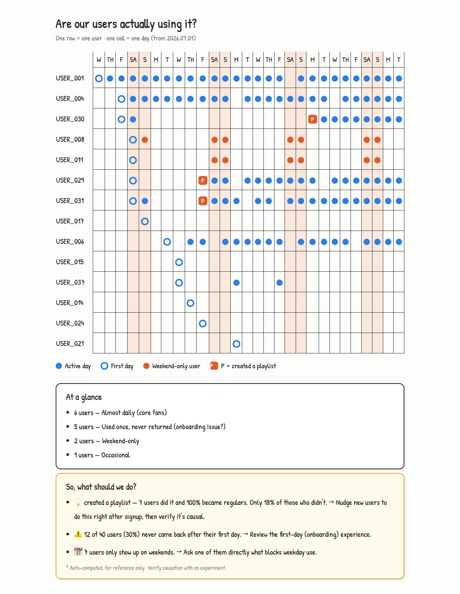

# Dot Plot MCP

> See individual users, not aggregate charts.

**English** | [한국어](README.ko.md)



## Install

```bash
claude mcp add --scope user dotplot -- uvx dotplot-mcp
```

## Use

Say this in any project:

> **"Analyze my product"**

You get the report above. That's it.

Claude finds your data, picks the action that means "this user got value", and
writes the report. No events table needed — your `orders` table already is one:

```sql
SELECT user_id, created_at::date AS date, 'purchase' AS event FROM orders
UNION ALL
SELECT user_id, added_at::date, 'add_to_wishlist' FROM wishlist_items
```

Nothing tracked yet? Say **"add the tracking I'm missing"** and Claude reads your
code, writes the logging that's absent, and tells you when to come back.

<details>
<summary>No product to analyze yet? Try the sample</summary>

```bash
git clone https://github.com/brownglasses/dotplot-mcp && cd dotplot-mcp
uv run sample_data.py   # 40 fake users with a pattern planted in them
uv run harness.py       # watch the whole pipeline run
```

</details>

## Why this exists

DAU/MAU charts go "up and to the right" as long as new users arrive — even when
nobody stays. Until you have hundreds of users, the most informative dashboard is
[YC's dot plot](https://www.youtube.com/watch?v=e5-6rEwzxLs) (David Lieb):
**one row per user, one cell per day.**

Four rules keep it honest:

- **Code computes, AI only interprets** — same data, same numbers, every time
- **Small samples withhold judgment** — under 5 users in a group, it says nothing
- **Correlation isn't cause** — every finding ships with "test this before you believe it"
- **Vanity metrics are refused** — pick `open_app` as your value event and the code says no

Reports come out in your language (English, 한국어, 日本語 built in; anything else
translated on the fly with the numbers verified intact).

## More

- [What each tool does, and the anonymous benchmark](docs/tools.md)
- [How it's built](docs/architecture.md)

MIT

<!-- mcp-name: io.github.brownglasses/dotplot-mcp -->
